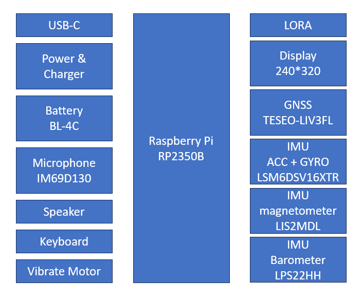
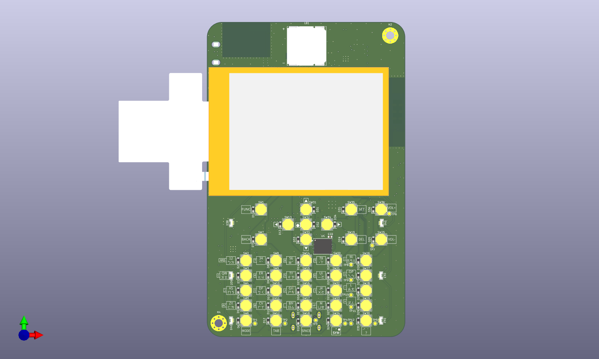
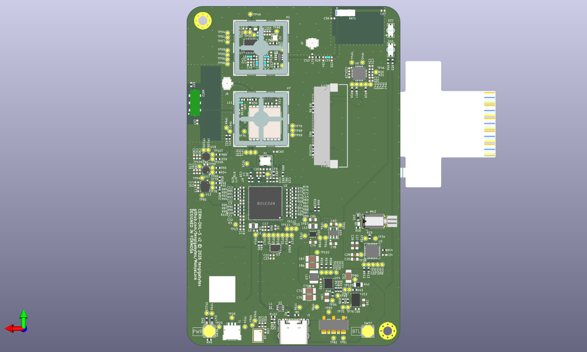

# MokyaLora

An open-hardware standalone Meshtastic feature phone built around the RP2350B dual-core MCU,
with a 36-key physical keyboard, 2.4″ IPS display, SX1262 LoRa radio, and GNSS.
Licensed under CERN-OHL-S-2.0 (hardware) and CC-BY-SA-4.0 (documentation).

## Project Status

### Hardware

| Revision | Status |
|----------|--------|
| Rev A | **Received 2026-04-02 — bringup in progress** — 21 of 25 steps fully passed; 3 open issues |

**Rev A bringup summary** (see [`docs/bringup/rev-a-bringup-log.md`](docs/bringup/rev-a-bringup-log.md) for full details):

| Step | Component | Result |
|------|-----------|--------|
| 1 | Power rails (1.8 V / 3.3 V) | ✅ PASS |
| 2 | MCU boot + USB CDC | ✅ PASS |
| 3 | I2C sensors (IMU / Mag / Baro / GNSS) | ✅ PASS |
| 4 | TFT LCD (ST7789VI, PIO 8080) | ✅ PASS (via FPC adapter — Issue 5) |
| 5 | LoRa SX1262 (SPI + RF link) | ✅ PASS (TX/RX verified — Step 23) |
| 6 | Keypad (6×6 matrix, 36 keys) | ✅ PASS |
| 7 | Audio — NAU8315 I2S amp + speaker | ✅ PASS |
| 8 | Battery (BQ25622 charger) + vibration motor | ⚠️ CONDITIONAL (charger OK; BQ27441 cold-boot NACK — Issue 10) |
| 9 | Flash + PSRAM (W25Q128JW + APS6404L) | ✅ PASS (QPI 37.5 MHz, 150 Mbit/s, 8 MB validated) |
| 10 | PDM microphone (IM69D130) | ⚠️ PARTIAL (capture/playback OK; background noise) |
| 11 | J-Link SWD debug | ✅ PASS |
| 12 | BQ27441 fuel gauge | ⚠️ CONDITIONAL (SOC readable; learning cycle pending) |
| 13 | TFT fast refresh (DMA) | ✅ PASS (60–80 FPS) |
| 14 | GNSS outdoor RF test | ❌ FAIL (0 satellites — Issue 11) |
| 15 | LoRa RF performance | ✅ PASS (Meshtastic mesh validated) |
| 16 | Core 1 (A–H stages) | ✅ PASS (FreeRTOS SMP, IPC, sensors, SPI) |
| 17 | Meshtastic integration | ✅ PASS (bidirectional mesh messaging) |
| 18–19 | Interactive menu + regression tests | ✅ PASS (51+ commands, TFT menu, 18/20 reliable) |
| 20–21 | Menu consolidation + code modularisation | ✅ PASS (21 source files, ~8580 lines) |
| 23 | LoRa standalone TX/RX | ✅ PASS (6 bug fixes, AES-128-CTR TX) |
| 24 | Core 1 TFT output + menu wrap-around | ✅ PASS |
| 25 | PSRAM DMA error investigation | ⚠️ CONDITIONAL (DMA burst read errors observed, root cause unconfirmed; CPU read workaround) |

**Open issues:** Issue 10 (BQ27441 cold-boot latchup), Issue 11 (GNSS 0 satellites), Issue 14 (PSRAM DMA burst read errors — root cause unconfirmed, no production impact).

### Firmware

| Component | Status |
|-----------|--------|
| Core 0 — Meshtastic modem | **Validated** — LoRa modem running on Rev A (v2.7.15 dev, `rp2350b-mokya` variant); bidirectional mesh messaging confirmed |
| Core 1 — FreeRTOS + UI | **Architecture validated** — FreeRTOS SMP, manual TinyUSB CDC, IPC, I2C sensors all proven on hardware; LVGL integration pending |
| MokyaInput Engine (MIE) | **Phase 1 complete** — full IME (Smart Zh/En, Direct, Bopomofo), C API, 83/83 tests passing |
| Bringup shell | **Active** — `firmware/tools/bringup/`; 51+ commands, TFT interactive menu, 21 source files |

## System Overview



## PCB Preview (Rev A)

| Front | Back |
|:-----:|:----:|
|  |  |

## Design Documents

| Document | Description |
|----------|-------------|
| [Schematic (PDF)](hardware/production/rev-a/pdf/MokyaLora.pdf) | Full schematic — all 13 sheets |
| [Assembly Drawing (PDF)](hardware/production/rev-a/pdf/MokyaLora__Assembly.pdf) | Component placement drawing |
| [Bill of Materials (CSV)](hardware/production/rev-a/MokyaLora.csv) | Rev A BOM |
| [Board 3D Model (STEP)](hardware/production/rev-a/MokyaLora.step) | Full-board STEP export |
| [Gerber Files](hardware/production/rev-a/gerber/) | Rev A fabrication outputs |

## Repository Layout

```
MokyaLora/
├── docs/
│   ├── assets/                         # Documentation images (block diagrams, etc.)
│   ├── requirements/                   # Requirements specifications
│   │   ├── system-requirements.md      # System-level spec, BOM highlights, mandatory HW rules
│   │   ├── hardware-requirements.md    # Full BOM, power tree, GPIO map, keypad matrix, design rules
│   │   └── software-requirements.md   # SW architecture, memory map, drivers, power states, UI/UX, IME
│   ├── design-notes/                   # Design decision records
│   │   ├── power-architecture.md       # Power tree, rail definitions, charger/gauge configuration
│   │   ├── rf-matching.md              # LoRa / GNSS RF frontend, TCXO coupling, antenna rules
│   │   └── mcu-gpio-allocation.md      # Full GPIO pin map, I2C bus allocation
│   ├── bringup/                        # Bring-up and debug logs
│   │   ├── rev-a-bringup-log.md
│   │   └── measurements/               # Oscilloscope / spectrum captures
│   └── manufacturing/                  # Manufacturing-related documents
│       ├── fab-notes.md                # PCB specification, Gerber list, assembly notes
│       └── compliance.md              # Regulatory notes (CE / FCC / NCC)
├── hardware/
│   ├── kicad/                          # KiCad 8 source design files
│   │   ├── MokyaLora.kicad_pro         # Project file
│   │   ├── MokyaLora.kicad_sch         # Top-level schematic (13 sub-sheets)
│   │   ├── MokyaLora.kicad_pcb         # PCB layout
│   │   ├── MokyaLora.kicad_sym         # Project symbol library
│   │   ├── *.kicad_dbl                 # Component database libraries (ODBC: KiCad-Library DSN)
│   │   ├── MokyaLora.pretty/           # Project footprint library (61 footprints)
│   │   ├── packages3D/                 # Component 3D models — see NOTICE for licensing
│   │   ├── FabricationFiles/           # KiCad fabrication output (Gerbers + BOM)
│   │   └── plots/                      # KiCad plot output (schematic PDF)
│   ├── production/                     # Released fabrication snapshots (copied from FabricationFiles)
│   │   └── rev-a/
│   │       ├── gerber/                 # Gerber + drill files
│   │       ├── pdf/                    # Schematic PDF + assembly drawing PDF
│   │       ├── MokyaLora.csv           # Bill of Materials
│   │       └── MokyaLora.step          # Full-board 3D export
│   └── mechanical/                     # Enclosure and stack-up drawings (future)
│       └── enclosure/
├── firmware/                           # Firmware (future — Arduino-Pico + FreeRTOS + LVGL)
│   ├── CMakeLists.txt
│   ├── core0/                          # Core 0 modem firmware [GPL-3.0]
│   │   └── src/                        # Meshtastic stack integration
│   ├── core1/                          # Core 1 UI & application firmware [Apache-2.0]
│   │   └── src/                        # LVGL, FreeRTOS, MIE integration
│   ├── mie/                            # MokyaInput Engine — IME sub-library [MIT]
│   │   ├── CMakeLists.txt              # Builds as static library; no Pico SDK dependency
│   │   ├── include/mie/                # Public headers
│   │   ├── src/                        # Trie-Searcher, IME-Logic
│   │   ├── hal/                        # IHalPort interface + rp2350 / pc adapters
│   │   ├── tools/                      # gen_font.py, gen_dict.py (data pipeline)
│   │   ├── data/                       # Generated .bin assets (gitignored)
│   │   └── tests/                      # C++ unit tests (host build only)
│   ├── shared/
│   │   └── ipc/                        # Inter-core IPC protocol definition [MIT]
│   │       └── ipc_protocol.h          # Sole interface boundary between Core 0 and Core 1
│   └── tools/                          # Flash scripts and test utilities
└── .gitignore
```

## Licenses

| Component             | Directory              | License          |
|-----------------------|------------------------|------------------|
| Hardware design       | `hardware/`            | CERN-OHL-S-2.0   |
| Documentation         | `docs/`                | CC-BY-SA-4.0     |
| Core 0 firmware       | `firmware/core0/`      | GPL-3.0          |
| Core 1 firmware       | `firmware/core1/`      | Apache-2.0       |
| MokyaInput Engine     | `firmware/mie/`        | MIT              |
| IPC protocol          | `firmware/shared/ipc/` | MIT              |

See [LICENSE](LICENSE) for the full rationale. License files are also present in each component directory.

## Authorship and Development Approach

| Area | Authorship |
|------|-----------|
| Requirements — technical concepts and design decisions | Project owner |
| Requirements — document writing and formatting | Assisted by [Claude Code](https://claude.ai/claude-code) |
| Hardware design (schematic, PCB layout) | Project owner |
| Documentation — organisation, formatting, and structure | Assisted by [Claude Code](https://claude.ai/claude-code) |
| Firmware and software development | Assisted by [Claude Code](https://claude.ai/claude-code) |

All technical concepts, design decisions, and hardware choices originate with the project
owner. Claude Code is used as a development tool; all AI-assisted output is reviewed and
accepted by the project owner before being committed.

## Disclaimer

> **This project is an experimental prototype. Use at your own risk.**

### Hardware

- **Prototype status** — Rev A is an unverified first prototype. The design has not been
  independently tested, reviewed, or certified. Do not use this design as the sole basis
  for a production product without thorough independent validation.

- **RF and wireless regulations** — This device incorporates a LoRa radio transmitter.
  Operation of radio transmitters is regulated by law in most jurisdictions (NCC in Taiwan,
  CE/RED in the EU, FCC Part 15 in the US, and equivalents elsewhere). The user is solely
  responsible for ensuring that any use of this design complies with applicable local
  wireless regulations. No regulatory certification (CE, FCC, NCC) has been obtained for
  this design.

- **Battery and electrical safety** — This design includes a lithium-ion battery charging
  circuit. Improper assembly, use of incorrect components, or failure to follow safe
  lithium-ion handling practices may result in fire, injury, or damage to property.
  Always verify the design independently before assembly.

- **No warranty** — This hardware is provided "as-is" without any warranty of any kind,
  express or implied. See [CERN-OHL-S-2.0](LICENSE-CERN-OHL-S-2.0.txt) Section 6 for the
  full disclaimer of warranties and limitation of liability.

### Firmware

- **Bringup firmware** — A hardware validation shell (`firmware/tools/bringup/`) is
  available for Rev A bring-up. It is a development/test tool only and is not intended
  for end-user deployment.

- **MokyaInput Engine (MIE)** — The IME sub-library (`firmware/mie/`) is available as a
  host-buildable static library with unit tests. It has not yet been integrated with
  RP2350B hardware.

- **Core 0 / Core 1** — Application firmware development has not yet started.

- **No warranty** — All firmware is provided "as-is" under its respective open-source
  licence (GPL-3.0 for Core 0, Apache-2.0 for Core 1, MIT for MIE and bringup tools)
  without any warranty of fitness for a particular purpose.

## Contributing

See [CONTRIBUTING.md](CONTRIBUTING.md) for contribution guidelines.
